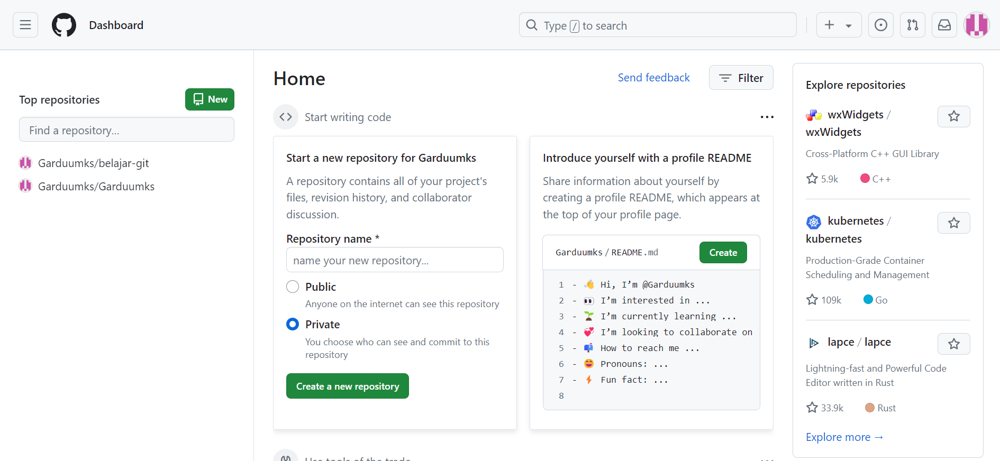

# Instalasi Git Bash
## 1.download Git pada browser ketik 'git-scm'

## 2.Lalu klik Git Hub yang telah di instal

## 3.Lalu akan muncul tampilan seperti gambar

## 4.Maka klik 'next' terus hingga mendapatkan tampilan seperti gambar

# Login Akun Github
1. Buka aplikasi github di browser 
2. Lalu lakukan sign up pada github

4. Jika sudah memiliki akun langsung masukkan password dan username yang ada

6. Jika tidak memiliki akun klik tambahkan akun

7. Setelah buat akun maka akan tampil seperti gambar

# Langkah - Langkah
## Buat Repositori GitHub Baru:
   - Login ke akun GitHub Anda.
   - Klik tombol "New" untuk membuat repositori baru.
   
   - Berikan nama repositori, pilih apakah akan bersifat publik atau privat, lalu klik "Create repository".

## konfigurasi git lokal
- Buka git di laptop/komputer anda.
- Jalankan perintah berikut untuk mengatur identitas Anda:
~~~sheel
git config --global user.name "nama"
git config --global user.email "email"
~~~

Note:untuk melihat apakah sudah terhubung konfigurasi git nya silakan ketik git config --list _contohnya_:

## Inisialisasi Git Lokal:
   -  Buat direktori baru untuk proyek Anda dan navigasikan ke direktori tersebut menggunakan Git bash. Kemudian, inisialisasi Git di direktori tersebut dengan menjalankan perintah:
 ~~~sheel
git init
~~~
 contohnya:
   
 
## Hubungkan ke Repositori GitHub:

   - Jalankan perintah berikut untuk menghubungkan repositori lokal Anda ke repositori GitHub yang telah Anda buat sebelumnya:
~~~
 git remote add origin https://github.com/username/nama-repository.git
 ~~~
   Ganti username dan nama-repository dengan nama pengguna GitHub Anda dan nama repositori yang Anda buat.kalo dah ada tulisan (master),berarti sudah terhubung ke repositori Githubnya
contohnya:

## Tambahkan file ke repositori: 
   - Perintah ini akan menambahkan semua file di direktori saat ini ke repositori.
   - Tambahkan file yang ingin Anda simpan di repositori Git dengan menjalankan perintah:
   ~~~
     git add 
~~~
contohnya:

# GIT STATUS

>[!Penjelasan]
`git status` adalah perintah dalam sistem kontrol versi Git yang digunakan untuk menampilkan status dari repository Git saat ini. Perintah ini memberikan informasi mengenai:

1. **Perubahan yang telah dilakukan:** Menunjukkan file-file yang telah diubah, tetapi belum di-stage untuk commit.
2. **File yang di-stage:** Menunjukkan file-file yang telah di-stage dan siap untuk di-commit.
3. **File yang belum dilacak:** Menunjukkan file-file baru yang belum ditambahkan ke dalam repository.

Dengan menggunakan `git status`, Kita dapat melihat status dari repository Kita, memahami apa yang telah berubah, dan memutuskan tindakan selanjutnya, seperti menambahkan file ke staging area atau melakukan commit perubahan.

Berikut Hasilnya :

# GIT PUSH ORIGIN (MASTER)

>[!Penjelasan]
>`git push origin master` digunakan dalam Git untuk mengunggah (push) perubahan yang ada di branch `master` pada repository lokal ke branch `master` di remote repository yang disebut `origin`.

Berikut penjelasan setiap komponen dari perintah tersebut:

- **`git push`**: Perintah dasar untuk mengunggah (push) commit dari repository lokal ke repository remote.
- **`origin`**: Nama default untuk remote repository yang biasanya ditetapkan saat Kita meng-clone repository. Ini mengacu pada URL remote repository tempat Kita akan mengirim perubahan.
- **`master`**: Nama branch yang ingin Kita push. Dalam banyak proyek, branch `master` adalah branch utama atau branch default, meskipun belakangan ini banyak proyek yang beralih ke menggunakan `main` sebagai branch default.

**Pesan kesalahan:**

- **`fatal: 'origin' does not appear to be a git repository`**: Ini berarti Git tidak dapat menemukan remote repository dengan nama `origin`.
- **`fatal: Could not read from remote repository`**: Ini berarti Git tidak dapat mengakses remote repository.

jika menunjukkan bahwa Git tidak dapat menemukan atau mengakses remote repository yang bernama `origin`

Kita Harus menambahkan semua perubahan yang ada di direktori kerja ke staging area menggunakan `git add .`

Jika Benar, Langkah Selanjutnya kita menggunakan perintah `git status` membantu kita memverifikasi bahwa perubahan sudah berada di staging area dan siap untuk di-commit.
# LS

>[!Penjelasan]
>`ls` di Git Bash adalah perintah yang digunakan untuk menampilkan daftar isi dari direktori saat ini di dalam lingkungan Git Bash.

Perintah `ls` sangat fleksibel dan memiliki banyak opsi lain yang bisa digunakan untuk mengatur tampilan daftar isi direktori sesuai dengan kebutuhan pengguna.

Berikut Hasilnya :

# CD 

>[!Penjelasan]
>Penjelasan `cd`:
>- **`cd`** adalah singkatan dari "change directory," yang berarti mengubah direktori.
>- - Perintah ini memungkinkan pengguna untuk berpindah dari satu direktori ke direktori lain dalam sistem file.

Dengan menggunakan perintah `cd` di Git Bash, Kita dapat dengan mudah menavigasi melalui berbagai direktori dalam sistem file Kita. Ini sangat berguna untuk mengelola proyek, mengakses file, dan menja lankan skrip atau program di lokasi yang berbeda.

Berikut Hasilnya :

### Langkah-langkah yang Dijalankan

1. **Pindah ke drive `D:`**
`cd d:`
- **Penjelasan**: Perintah ini digunakan untuk berpindah ke drive `D:` di komputer Kita.

- **Output**:
`ASUS@Fahryy MINGW64 /d`

2. **Pindah ke direktori `obsidian` di dalam drive `D:`**

`cd obsidian`

- **Penjelasan**: Perintah ini digunakan untuk berpindah ke direktori `obsidian` yang berada di dalam drive `D:`.

3. **Pindah ke direktori `BELAJAR_GITHUB` di dalam direktori `obsidian`**

`cd BELAJAR_GITHUB`

- **Penjelasan**: Perintah ini digunakan untuk berpindah ke direktori `BELAJAR_GITHUB` yang berada di dalam direktori `obsidian`.

- **Output**:

` /d/obsidian/BELAJAR_GITHUB`
### Keseluruhan Proses

- **Navigasi Awal:**

 Kita memulai di home directory (direktori awal) pada Git Bash.
 Perintah `cd d:` digunakan untuk berpindah dari home directory ke drive `D:`.

- **Navigasi Kedua:**

- Setelah berada di drive `D:`, Kita menggunakan perintah `cd obsidian` untuk masuk ke dalam direktori `obsidian` yang ada di drive `D:`.

- **Navigasi Ketiga:**

- Dari direktori `obsidian`, Kita menggunakan perintah `cd BELAJAR_GITHUB` untuk masuk ke dalam sub-direktori `BELAJAR_GITHUB`.

### Kesimpulan

Kita telah menggunakan serangkaian perintah `cd` di Git Bash untuk menavigasi melalui sistem file dari drive `D:`, kemudian ke direktori `obsidian`, dan akhirnya ke direktori `BELAJAR_GITHUB`. Setiap perintah `cd` digunakan untuk berpindah ke direktori yang lebih spesifik dalam hirarki direktori.

## buat commit
- Jalankan perintah berikut untuk membuat commit dengan pesan yang jelas:
   - Perintah git commit -m *"Pesan commit"* digunakan untuk menyimpan perubahan yang telah dilakukan pada repositori Git dengan menambahkan pesan
     ~~~sheel
     git commit -m "Pesan commit"
     ~~~
    *contohnya:*
